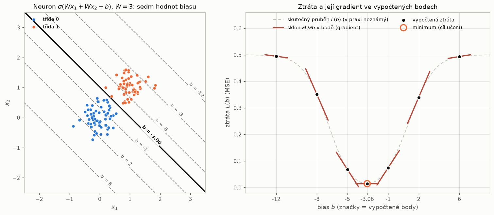
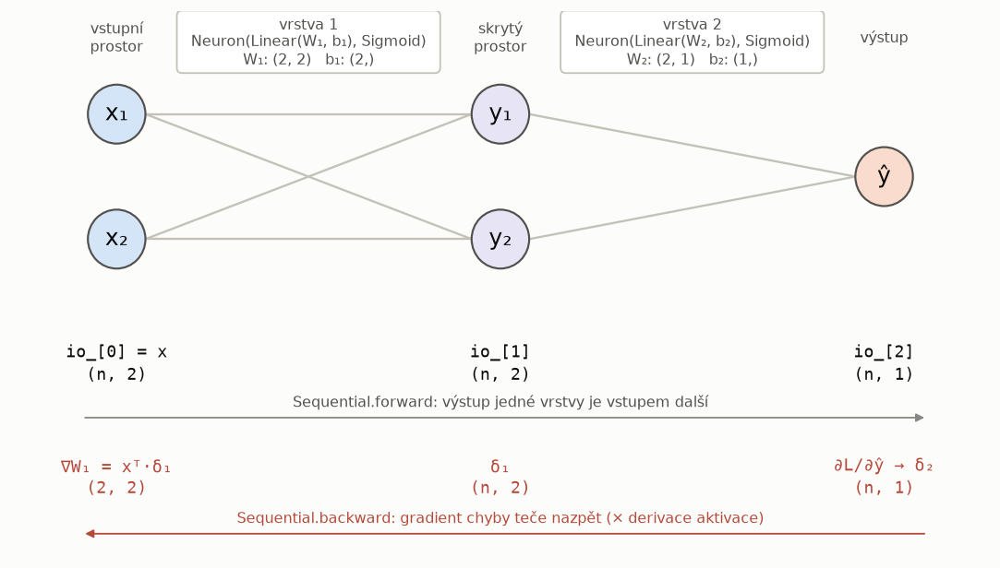

# Cvičení 10: Učení sítě gradientním sestupem — zpětné šíření chyby

Desáté praktické cvičení předmětu **Umělá inteligence v medicíně** dále rozvíjí
blok neuronových sítí. V Cvičení 08 jsme sestavili neuron, v Cvičení 09 jsme
neurony skládali do vícevrstvých sítí a váhy **navrhovali ručně** z geometrie
úlohy. Pro síť nad 30 příznaky datasetu Breast Cancer Wisconsin už ruční návrh
možný není. Váhy se proto síť musí **naučit z dat**.

Učení zde formulujeme jako **minimalizaci ztrátové funkce gradientním
sestupem**. Gradient ztráty podle všech vah sítě počítá **zpětné šíření chyby
(backpropagation)**: opakovaná aplikace řetězového pravidla od výstupní vrstvy
ke vstupní. Celé cvičení je napsáno v NumPy nad stejnou objektovou architekturou
jako Cvičení 08 a 09 (`Linear`, `Activation`, `Neuron`, `Sequential`). Uvidíte
tak konkrétní maticové operace, které knihovny typu PyTorch skrývají za
automatické derivování (*autograd*).

Většina kódu jsou známé vzory naplněné novým obsahem nebo předpřipravená
infrastruktura. **Jediná koncepčně nová věc je zpětný průchod** a na ni se
cvičení soustředí.

---

## Obsah

1. [Cíle cvičení](#cíle-cvičení)
2. [Struktura repozitáře](#struktura-repozitáře)
3. [Instalace a spuštění](#instalace-a-spuštění)
4. [Teoretický základ](#teoretický-základ)
5. [Konfigurace projektu](#konfigurace-projektu)
6. [Pokyny k vypracování](#pokyny-k-vypracování)
7. [Lokální testování](#lokální-testování)
8. [Doplňkové (papírové) příklady](#doplňkové-papírové-příklady)
9. [Odevzdání](#odevzdání)

---

## Cíle cvičení

Po dokončení tohoto cvičení student:

1. **Chápe učení jako minimalizaci ztráty.** Ztrátová funkce $L$ měří
   odchylku výstupu sítě od cíle a nad prostorem vah tvoří „krajinu". Učení je
   hledání jejího minima.
2. **Ovládá gradientní sestup.** Umí vysvětlit roli kroku učení
   (`learning_rate`), rozdíl mezi stochastickým (`batch_size = 1`), dávkovým
   a minidávkovým sestupem a význam epochy.
3. **Rozšíří dopředný průchod o záznam mezistavů.** `Sequential.forward`
   kromě výstupů vrstev `io_` ukládá i předaktivační hodnoty `z_`, které
   zpětný průchod potřebuje.
4. **Implementuje zpětné šíření chyby.** Odvodí a naprogramuje
   $\delta^{(\ell)} = \partial L/\partial \mathbf{z}^{(\ell)}$ pro všechny
   vrstvy a z nich gradienty vah $\partial L/\partial W_\ell = \mathbf{a}^{(\ell-1)\top}\delta^{(\ell)}$.
5. **Chápe váhy jako měnitelný stav vrstvy.** `Linear.update` posune váhy
   **proti** gradientu. Znaménková konvence je v celém cvičení jednotná.
6. **Ověřuje gradient numericky.** Porovnáním s centrální diferencí odhalí
   chybu v derivaci, znaménku nebo transpozici dřív, než se projeví jako
   „síť se neučí".
7. **Rozumí vlivu inicializace.** Ví, proč nulové váhy nefungují, proč příliš
   velké váhy vedou k saturaci sigmoidy a mizejícímu gradientu a jak
   škálování Xavier udrží signál v rozumném rozsahu.
8. **Volí ztrátovou funkci.** Porovná střední kvadratickou chybu (MSE)
   a binární křížovou entropii (BCE) a vysvětlí, proč se BCE se sigmoidou
   při saturaci nezastaví.
9. **Odděluje model od procesu učení.** Model umí jeden krok učení, `Trainer`
   z kroků skládá proces (epochy, dávky, stav `train`/`eval`, logování).

---

## Struktura repozitáře

```
cviceni-10-template/
├── .github/
│   └── workflows/
│       └── tests.yml          # CI: po každém push spustí pytest (PŘEDVYPLNĚNO)
├── cviceni_10.py              # Pipeline, celá PŘEDVYPLNĚNA (sedm fází)
├── config.yaml                # Konfigurace (data, architektura, učení, ztráta)
├── priklady_10.md             # Papírové příklady, BEZ řešení
├── requirements.txt           # Python závislosti (zamčené verze)
├── .gitignore
├── README.md
├── docs/
│   ├── img/                   # Obrázky k tomuto README
│   └── code/                  # Skripty, které obrázky vygenerovaly (nespouštějte)
├── src/
│   ├── __init__.py            # Re-exporty balíčku (neupravujte)
│   ├── activations.py         # BRÁNA+ z Cvičení 09; ÚKOL: derivative() u všech aktivací
│   ├── linear.py              # BRÁNA+ z Cvičení 09; ÚKOL: update()
│   ├── neuron.py              # BRÁNA z Cvičení 09 beze změny (včetně save/load)
│   ├── network.py             # BRÁNA+ z Cvičení 09; ÚKOL: forward() se z_, backward(), update(); save()/load() předvyplněny
│   ├── losses.py              # ÚKOL: MSE a BCE (forward, gradient); Loss a make_loss předvyplněny
│   ├── initializers.py        # ÚKOL: XavierInit, BONUS: HeInit; ostatní (vč. PyTorchDefaultInit) předvyplněno
│   └── trainer.py             # Trainer s logováním (PŘEDVYPLNĚNO)
├── dataio/
│   ├── __init__.py            # Re-exporty balíčku (neupravujte)
│   ├── loader.py              # load_breast_cancer_data(): rozdělení a standardizace (předvyplněno)
│   ├── config_manager.py      # Dataclassy + load_config + validate_config (předvyplněno)
│   ├── metrics.py             # Matice záměn 2×2, accuracy/precision/recall (předvyplněno)
│   └── plotting.py            # Křivka učení, matice záměn (předvyplněno)
├── data/                      # Prázdné, dataset se načítá ze sklearn
│   └── .gitkeep
├── graphs/                    # Výstupní grafy (generují se automaticky)
│   └── .gitkeep
├── logs/                      # Log učení trainer.log (generuje se automaticky)
│   └── .gitkeep
├── models/                    # Naučená síť ze Sequential.save (.npz, generuje fáze 7)
│   └── .gitkeep
└── test_cviceni_10.py         # Automatické testy (pytest)
```

> **Poznámka k souborům `__init__.py`:** Každá složka s Python kódem (`src/`,
> `dataio/`) obsahuje `__init__.py`, který ji označuje jako balíček a definuje
> veřejné API. Díky tomu lze psát `from src import Sequential` místo
> `from src.network import Sequential`. **Tyto soubory neupravujte.**

> **Brána a brána+.** Soubory označené BRÁNA obsahují rozhraní z Cvičení 09,
> do kterého vložíte své řešení. Soubory označené BRÁNA+ navíc obsahují
> **nové metody** tohoto cvičení. U nich proto **nepřepisujte celý soubor**
> svým starým řešením, ale zkopírujte jen těla metod známých z Cvičení 09.

> **Žádná nová třída vrstvy.** Vrstvou sítě zůstává `Neuron` z Cvičení 08 a 09
> s maticí vah `(n_vstupů, n_jednotek)` a vektorem biasu `(n_jednotek,)`.
> V Cvičení 09 jsme předeslali, že místo studenta dodá váhy inicializátor
> a třída vrstvy zůstane stejná. Přesně to se nyní děje. Jedinou změnou
> vrstvy je metoda `Linear.update`: váhy přestávají být konstantou
> a stávají se měnitelným stavem.

> **Balíček `dataio/` a třída `Trainer` jsou předvyplněny celé** a žádný
> `NotImplementedError` v nich není. Logování v `Trainer` nepíšete, pouze
> pozorujete jeho výstup v konzoli a v souboru `logs/trainer.log`.

> **Perzistence není novým úkolem.** `Neuron.save`/`load` zůstává v
> `src/neuron.py` jako spojovací nit mezi cvičeními a ukládá jednu vrstvu.
> Celou síť ukládá do jednoho souboru předvyplněná metoda `Sequential.save`
> (klíče `Neuron.save` s předponou `vrstva<k>_`), načítá ji
> `Sequential.load`. Pipeline je používá ve fázi 7 a naučenou síť ukládá do
> `models/sit_<architektura>_<inicializátor>_<ztráta>.npz`.

---

## Instalace a spuštění

### 1. Vytvoření virtuálního prostředí

```bash
python -m venv .venv
```

Aktivace (Windows):
```bash
.venv\Scripts\activate
```

Aktivace (Linux / macOS):
```bash
source .venv/bin/activate
```

### 2. Instalace závislostí

```bash
pip install -r requirements.txt
```

### 3. Spuštění

```bash
python cviceni_10.py
```

Pipeline má sedm fází a **každá fáze má vlastní ošetření chyb**:

| Fáze | Obsah | Co potřebuje hotové |
|:---|:---|:---|
| 1 | načtení, rozdělení a standardizace dat | nic (předvyplněno) |
| 2 | kontrola gradientu: `backward` vs. numerická derivace | brána, derivace aktivací, ztráty, `forward`, `backward` |
| 3 | sestavení sítě 30-9-4-1, inicializace vah | `XavierInit` (jinak náhradní `RandomUniformInit`) |
| 4 | jeden krok učení na jednom vzorku | vše z fáze 2 + `Linear.update`, `Sequential.update` |
| 5 | učení (`Trainer.run`), logování do `logs/` | totéž |
| 6 | matice záměn, metriky, křivka učení do `graphs/` | úspěšná fáze 5 |
| 7 | uložení naučené sítě do `models/` (`Sequential.save`) a kontrolní načtení | úspěšná fáze 5 (ukládání je předvyplněno) |

Dokud nejsou úkoly hotové, fáze, která narazí na nedokončenou část, skončí
hláškou `[NENI HOTOVO] Úkol: …` a pipeline **pokračuje další fází**. Selže-li
již doplněná část (nesplněný assert, nesouhlasící tvary polí), fáze skončí
hláškou `[CHYBA IMPLEMENTACE]` s popisem výjimky. Nikdy nedostanete holý
traceback. Fáze 3 při nedokončeném `XavierInit` použije
předvyplněný `RandomUniformInit(-1, 1)`, takže síť lze učit dříve, než
inicializaci dokončíte. Výsledky obou inicializací pak můžete porovnat.

> **Jediná výjimka je načtení konfigurace.** Nesmyslná hodnota v `config.yaml`
> ukončí pipeline hned na začátku hláškou `[CHYBA KONFIGURACE]`.

S referenční implementací a výchozí konfigurací trvá učení na běžném
notebooku několik sekund. Trénovací ztráta klesne pod `max_loss = 0,01`
přibližně po 60 epochách a přesnost na testovacích datech je kolem 0,99.

---

## Teoretický základ

### 1. Učení jako minimalizace ztráty

Síť s parametry $\theta = (W_1, \mathbf{b}_1, \dots, W_L, \mathbf{b}_L)$
realizuje funkci $\hat{\mathbf{y}} = f(\mathbf{x};\theta)$. **Ztrátová funkce**
$L(\theta)$ měří, jak moc se výstupy sítě na trénovacích datech liší od
cílových hodnot, například střední kvadratickou chybou

$$L(\theta) = \frac{1}{N}\sum_{i=1}^{N}\big(y_i - \hat{y}_i\big)^2 .$$

Pevná trénovací data dělají z $L$ funkci **pouze vah**. Nad prostorem vah
tvoří „krajinu" a **učení je hledání jejího minima**. V Cvičení 09 jsme
vhodné váhy odvodili z geometrie, nyní je bude hledat algoritmus.

Obrázek ukazuje řez takovou krajinou pro jediný sigmoidový neuron
$\sigma(3x_1 + 3x_2 + b)$ nad dvěma shluky bodů. Váhy jsou pevné a mění se
jen bias $b$, takže krajina je jednorozměrná:



Vlevo jsou rozhodovací přímky pro sedm hodnot biasu: přímka s nejmenší
ztrátou ($b \approx -3{,}1$, plná čára) a po třech hodnotách na každou stranu.
Vpravo je pro **každou z těchto sedmi přímek** vypočtená ztráta $L(b)$ (černý
bod) a sklon $\partial L/\partial b$ v tomto bodě (cihlová tečna). Nic víc
vypočteno není. Slabá čárkovaná křivka ukazuje skutečný průběh $L(b)$ pouze
pro názornost.

> **Tvar celé krajiny neznáme.** Pro síť se stovkami parametrů nelze $L$
> vyčíslit „všude", krajina má tolik rozměrů, kolik má síť parametrů. Učící
> algoritmus v každém kroku zná jen hodnotu ztráty a gradient **v jediném
> bodě**, tedy v aktuálních vahách. To stačí: gradient říká, kterým směrem
> ztráta klesá, a krok proti němu vede k nižší ztrátě. Zpětné šíření chyby
> (odd. 4) je efektivní způsob, jak tento bodový gradient spočítat.

Minimum odpovídá přímce, která shluky odděluje. Skutečná křivka má tvar
**misky se zploštělými konci**. Pro $b \ll 0$ dává neuron na všech bodech
výstup blízko 0, pro $b \gg 0$ blízko 1. Sigmoida je v obou případech
**saturovaná**, změna biasu výstup téměř nemění a $\partial L/\partial b
\approx 0$. Je to vidět na tečnách v bodech $b = -12$ a $b = 6$: ztráta je
tam vysoká, a přesto je sklon téměř vodorovný.

> **Proč na tvaru krajiny záleží.** Gradientní sestup vidí jen **místní
> sklon**. V ploché oblasti je sklon téměř nulový a kroky jsou nepatrné,
> i když je minimum daleko. Síť, která začne v saturaci, se proto učí velmi
> pomalu. Tento jev (mizející gradient) se vrací v odd. 5–7.

### 2. Gradientní sestup

Gradient $\nabla_\theta L$ ukazuje směr **nejstrmějšího růstu** ztráty.
Gradientní sestup proto postupuje **proti** němu:

$$\theta \leftarrow \theta - \eta\,\nabla_\theta L(\theta),$$

kde $\eta > 0$ je **krok učení** (`learning_rate`). Malý krok znamená pomalé,
ale stabilní učení. Příliš velký krok minimum přeskakuje a učení může
divergovat.

V kódu platí tato **znaménková konvence**: `Sequential.backward` vrací
**skutečné gradienty** $\partial L/\partial W$ (směr růstu chyby)
a `Linear.update` je **odečítá**: `W = W - learning_rate * dW`.

Podle toho, z kolika vzorků se gradient v jednom kroku počítá, rozlišujeme:

| Varianta | `batch_size` | Kroků za epochu ($N = 455$) | Vlastnosti |
|:---|:---:|:---:|:---|
| stochastický gradientní sestup (SGD) | 1 | 455 | levný a „hlučný" krok, váhy se mění po každém vzorku |
| minidávkový sestup | např. 32 | 15 | kompromis, standard v praxi |
| dávkový (plný) sestup | $N$ | 1 | přesný gradient, ale jediný krok za epochu |

**Epocha** je jeden průchod všemi trénovacími vzorky. Před každou epochou se
pořadí vzorků náhodně promíchá, aby síť neviděla data stále ve stejném
pořadí. Výchozí `batch_size = 1` umožňuje sledovat, jak jediný vzorek posune
váhy (fáze 4 pipeline). Konfigurace dále po každých `lr_decay_every` epochách
násobí krok učení faktorem `lr_decay < 1`: v blízkosti minima jsou menší kroky
přesnější.

### 3. Dopředný průchod a mezistavy

Značení je stejné jako v Cvičení 09: řádek matice je vzorek a sloupec matice
vah je neuron. Pro dávku $N$ vzorků a vrstvy $\ell = 1,\dots,L$:

$$A^{(0)} = X, \qquad Z^{(\ell)} = A^{(\ell-1)}\,W_\ell + \mathbf{b}_\ell, \qquad A^{(\ell)} = f\big(Z^{(\ell)}\big), \qquad \hat{Y} = A^{(L)}.$$

`Sequential.forward` si během průchodu ukládá **obě** posloupnosti:

| Atribut | Obsah | Délka | Prvek `[k]` má tvar |
|:---|:---|:---:|:---|
| `io_` (z Cvičení 09) | $[\,X, A^{(1)}, \dots, A^{(L)}\,]$, vstupy a výstupy vrstev | $1 + L$ | `(N, n_jednotek)` vrstvy `k` (pro `k = 0` vstup) |
| `z_` (**NOVÉ**) | $[\,Z^{(1)}, \dots, Z^{(L)}\,]$, předaktivační hodnoty | $L$ | `(N, n_jednotek)` vrstvy `k + 1` |

Obojí zpětný průchod potřebuje. `io_[k]` je **vstupem** vrstvy `layers[k]`
a vstupuje do gradientu jejích vah. `z_[k]` je bod, ve kterém se počítá
**derivace aktivace** této vrstvy. `Neuron.forward` vrací jen výstup, proto
`Sequential.forward` volá složky vrstvy zvlášť: nejprve `layer.linear`, pak
`layer.activation`.

### 4. Zpětné šíření chyby (backpropagation)

Síť je složená funkce a gradient složené funkce dává **řetězové pravidlo**.
Pro jednu vrstvu $\mathbf{a} = f(\mathbf{z})$, $\mathbf{z} = \mathbf{a}_{\text{in}}W + \mathbf{b}$
platí:

$$\frac{\partial L}{\partial \mathbf{z}} = \frac{\partial L}{\partial \mathbf{a}} \odot f'(\mathbf{z}), \qquad \frac{\partial L}{\partial W} = \mathbf{a}_{\text{in}}^{\top}\,\frac{\partial L}{\partial \mathbf{z}}, \qquad \frac{\partial L}{\partial \mathbf{a}_{\text{in}}} = \frac{\partial L}{\partial \mathbf{z}}\,W^{\top},$$

kde $\odot$ je násobení prvek po prvku. Třetí vztah je gradient podle
**vstupu** vrstvy, tedy podle výstupu vrstvy předchozí. Tím se chyba předá
o vrstvu níž a postup se opakuje. Zavedeme **deltu** vrstvy
$\delta^{(\ell)} = \partial L/\partial Z^{(\ell)}$ (tvar `(N, n_jednotek)`):

$$\delta^{(L)} = \frac{\partial L}{\partial \hat{Y}} \odot f'\big(Z^{(L)}\big), \qquad \delta^{(\ell)} = \big(\delta^{(\ell+1)}\,W_{\ell+1}^{\top}\big) \odot f'\big(Z^{(\ell)}\big),$$

$$\frac{\partial L}{\partial W_\ell} = A^{(\ell-1)\top}\,\delta^{(\ell)}, \qquad \frac{\partial L}{\partial \mathbf{b}_\ell} = \sum_{i=1}^{N} \delta^{(\ell)}_{i,:}.$$



Diagram rozšiřuje schéma z Cvičení 09 o zpětnou cestu. Data tečou dopředu
(šedě), gradient chyby teče nazpět (cihlově) a v každé vrstvě se násobí
derivací aktivace. Derivace je potřeba na **dvou místech**: derivace
**ztrátové funkce** na výstupu, kterou zpětný průchod startuje
(`Loss.gradient`), a derivace **aktivace** uvnitř každé vrstvy
(`Activation.derivative`).

| Veličina | Kód | Tvar |
|:---|:---|:---|
| $\partial L/\partial \hat{Y}$ | `loss.gradient(prediction, target)` | `(N, n_výstupů)` |
| $Z^{(\ell)}$, $A^{(\ell-1)}$ | `z_[l-1]`, `io_[l-1]` | `(N, n_ℓ)`, `(N, n_{ℓ-1})` |
| $\delta^{(\ell)}$ | `delta` | `(N, n_ℓ)`, stejný jako $Z^{(\ell)}$ |
| $\partial L/\partial W_\ell = A^{(\ell-1)\top}\delta^{(\ell)}$ | `io_[l-1].T @ delta` | `(n_{ℓ-1}, n_ℓ)`, stejný jako $W_\ell$ |
| $\partial L/\partial \mathbf{b}_\ell$ | `delta.sum(axis=0)` | `(n_ℓ,)`, stejný jako $\mathbf{b}_\ell$ |
| $\partial L/\partial A^{(\ell-1)} = \delta^{(\ell)}W_\ell^{\top}$ | `delta @ W.T` | `(N, n_{ℓ-1})` |

> **Kontrola tvarů jako vodítko.** Gradient parametru má vždy stejný tvar
> jako parametr sám. Nevíte-li, zda transponovat, nebo v jakém pořadí
> násobit, stačí zkontrolovat tvary. Jiná kombinace, která by dala
> `(n_{ℓ-1}, n_ℓ)`, neexistuje.

> **Proč se přes vzorky sčítá.** Maticový součin `io_[l-1].T @ delta` sečte
> příspěvky všech $N$ vzorků dávky. Průměr (faktor $1/N$) už obsahuje
> gradient ztráty, protože ztráta je definována jako průměr (odd. 6).
> Proto se bias sčítá (`sum`), nikoli průměruje.

Zpětný průchod je stejně drahý jako dopředný: jde o tytéž maticové součiny
v opačném pořadí. Proto je učení velkých sítí vůbec proveditelné. PyTorch
dělá totéž automaticky (`loss.backward()`): během dopředného průchodu si
zapamatuje mezistavy a pak aplikuje řetězové pravidlo. Zde každý krok píšete
sami.

`backward` váhy **nemění**. Gradient pro nižší vrstvu se počítá z vah
**před** aktualizací a změnu provede teprve `update`. Model tedy umí jeden
krok učení ve třech voláních:

```python
prediction = model.forward(x_batch)                               # 1. predikce + mezistavy
gradients  = model.backward(loss.gradient(prediction, y_batch))   # 2. gradienty všech vrstev
model.update(gradients, learning_rate)                            # 3. posun vah proti gradientu
```

### 5. Derivace aktivačních funkcí

Metoda `derivative(x)` dostává **předaktivační** hodnotu $x = z$ (prvek
`z_`), nikoli výstup aktivace. U sigmoidy a tanh se derivace pohodlně
vyjádří pomocí hodnoty funkce samotné:

| Aktivace | $f(x)$ | $f'(x)$ | Obor $f'$ |
|:---|:---|:---|:---|
| `Sigmoid(T)` | $\sigma_T(x) = \dfrac{1}{1+e^{-x/T}}$ | $\dfrac{1}{T}\,\sigma_T(x)\big(1-\sigma_T(x)\big)$ | $(0,\ \tfrac{1}{4T}]$ |
| `Tanh` | $\tanh x$ | $1 - \tanh^2 x$ | $(0,\ 1]$ |
| `ReLU` | $\max(0, x)$ | $1$ pro $x > 0$, jinak $0$ | $\{0, 1\}$ |
| `ReLU6` | $\min(\max(0,x), 6)$ | $1$ pro $0 < x < 6$, jinak $0$ | $\{0, 1\}$ |
| `Step` | $1$ pro $x \ge 0$, jinak $0$ | $0$ (v bodě $0$ neexistuje) | $\{0\}$ |

Pro sigmoidu platí $\sigma'(u) = \sigma(u)\big(1-\sigma(u)\big)$ a faktor
$1/T$ pochází z vnitřní funkce $u = x/T$. V bodech zlomu ReLU a ReLU6
derivace neexistuje a konvenčně se volí 0, stejně jako v PyTorch.

> **Saturace.** Derivace sigmoidy je nejvýše $1/(4T)$ a pro $|z| \gg T$ je
> prakticky nulová. Protože se $\delta$ v každé vrstvě **násobí** derivací
> aktivace, několik saturovaných vrstev za sebou gradient utlumí téměř na
> nulu. To je **problém mizejícího gradientu**. `Step` je extrémní případ:
> jeho derivace je nulová všude, a proto se síť se skokovou aktivací
> gradientním sestupem učit nedá. Proto v tomto cvičení používáme sigmoidu.

### 6. Volba ztrátové funkce: MSE vs. BCE

Obě ztráty jsou definovány jako **průměr** přes všechny prvky výstupu
($N$ = `prediction.size`) a jejich gradient proto obsahuje faktor $1/N$:

| Ztráta | $L(\hat{\mathbf{y}}, \mathbf{y})$ | $\partial L / \partial \hat{y}_i$ |
|:---|:---|:---|
| MSE | $\dfrac{1}{N}\sum_i (y_i - \hat{y}_i)^2$ | $\dfrac{2}{N}(\hat{y}_i - y_i)$ |
| BCE | $-\dfrac{1}{N}\sum_i \big[y_i\ln\hat{y}_i + (1-y_i)\ln(1-\hat{y}_i)\big]$ | $\dfrac{1}{N}\,\dfrac{\hat{y}_i - y_i}{\hat{y}_i(1-\hat{y}_i)}$ |

Rozdíl je vidět na deltě výstupní sigmoidové vrstvy
$\delta^{(L)} = \partial L/\partial \hat{y} \cdot \sigma_T'(z)$
s $\sigma_T'(z) = \tfrac{1}{T}\hat{y}(1-\hat{y})$:

$$\text{MSE:}\quad \delta^{(L)}_i = \frac{2}{NT}\,(\hat{y}_i - y_i)\,\hat{y}_i(1-\hat{y}_i), \qquad\qquad \text{BCE:}\quad \delta^{(L)}_i = \frac{1}{NT}\,(\hat{y}_i - y_i).$$

U BCE se derivace sigmoidy **vykrátí**. Hrubě chybná, ale „přesvědčená"
predikce (například $\hat{y} = 0{,}01$ pro $y = 1$) dává u BCE velkou deltu
úměrnou chybě. U MSE je táž delta utlumena faktorem
$\hat{y}(1-\hat{y}) \approx 0{,}01$, takže síť se ze saturované chyby dostává
velmi pomalu. BCE je navíc přirozenou ztrátou pro výstup interpretovaný jako
pravděpodobnost třídy (logaritmická věrohodnost Bernoulliho rozdělení).

> **Numerická stabilita.** Pro $\hat{y} \in \{0, 1\}$ by BCE obsahovala
> $\ln 0$ a dělení nulou. Implementace proto predikce nejprve ořízne do
> intervalu $[\varepsilon,\ 1-\varepsilon]$ s $\varepsilon = 10^{-12}$
> (`np.clip`).

> **Očekávejte realistický rozdíl.** Na standardizovaných datech tohoto
> cvičení a s inicializací Xavier jsou výstupy na začátku učení daleko od
> saturace a obě ztráty konvergují srovnatelně rychle. Výhoda BCE se
> projeví hlavně tam, kde výstup saturuje na špatné straně, například při
> nevhodné inicializaci. Hodnoty obou ztrát navíc nejsou přímo srovnatelné,
> protože stejný práh `max_loss` znamená pro MSE a BCE něco jiného.
> Porovnávejte proto přesnost na testovacích datech a průběh křivky učení.

### 7. Inicializace vah

**Nulové váhy nefungují.** Všechny neurony vrstvy by počítaly totéž, dostaly
stejný gradient a zůstaly by stejné i po libovolném počtu kroků. Tuto
symetrii je třeba rozbít náhodnou inicializací. Náhodnost ale nestačí,
rozhoduje **měřítko**. Pro standardizované vstupy (nulový průměr, jednotkový
rozptyl) a nezávislé váhy s nulovým průměrem platí přibližně

$$\operatorname{Var}(z) \approx n_{\text{in}} \cdot \operatorname{Var}(W).$$

Rozptyl předaktivační hodnoty tedy roste s počtem vstupů.

> **Značení $U(-a, a)$.** Jde o **rovnoměrné (uniformní) rozdělení** na
> intervalu $[-a, a]$: každá hodnota z intervalu je stejně pravděpodobná
> a jiné hodnoty nenastanou. Nejde o normální (Gaussovo) rozdělení. Jeho
> rozptyl je $\operatorname{Var}(W) = a^2/3$. Zápis $U(\pm a)$ je zkratka
> téhož. Všechny inicializátory v tomto cvičení losují váhy tímto způsobem
> (`rng.uniform(-a, a, size=...)`). Knihovny nabízejí i normální varianty
> se stejným rozptylem, například `xavier_normal_` a `kaiming_normal_`
> v PyTorch s $W \sim \mathcal{N}(0, \sigma^2)$.

Pro první vrstvu naší sítě ($n_{\text{in}} = 30$, $n_{\text{out}} = 9$):

| Inicializace | $\operatorname{Var}(W)$ | směr. odchylka $z$ (odhad) | naměřené průměrné $\lvert z\rvert$ | důsledek pro $\sigma_T$, $T = 0{,}5$ |
|:---|:---:|:---:|:---:|:---|
| výchozí PyTorch, $U(\pm 1/\sqrt{30})$ | $1/90 \approx 0{,}011$ | $\approx 0{,}58$ | $0{,}44$ | citlivá oblast, spíše slabý signál |
| Xavier, $U(\pm\sqrt{6/(30+9)})$ | $2/39 \approx 0{,}051$ | $\approx 1{,}2$ | $0{,}94$ | převážně v citlivé oblasti |
| `RandomUniformInit(-1, 1)` | $1/3$ | $\approx 3{,}2$ | $2{,}40$ | častá saturace |
| `RandomUniformInit(-5, 5)` | $25/3$ | $\approx 15{,}8$ | $12{,}0$ | téměř úplná saturace |

**Xavier (Glorot) inicializace** volí rozptyl vah tak, aby se velikost
signálu při průchodu vrstvami dopředu i nazpět zhruba zachovávala:

$$W \sim U\!\left(-\sqrt{\frac{6}{n_{\text{in}} + n_{\text{out}}}},\ \sqrt{\frac{6}{n_{\text{in}} + n_{\text{out}}}}\right), \qquad \operatorname{Var}(W) = \frac{2}{n_{\text{in}} + n_{\text{out}}}.$$

Je vhodná pro sigmoidu a tanh. Pro ReLU sítě se používá **He inicializace**
s $\operatorname{Var}(W) = 2/n_{\text{in}}$ (bonusový úkol), protože ReLU
propouští jen kladnou polovinu signálu.

**Výchozí inicializace v PyTorch** (`PyTorchDefaultInit`, předvyplněno pro
srovnání) není ani Xavier, ani He. Vrstva `nn.Linear` volá
`kaiming_uniform_(weight, a=√5)` a dosazením vyjde

$$W \sim U\!\left(-\frac{1}{\sqrt{n_{\text{in}}}},\ \frac{1}{\sqrt{n_{\text{in}}}}\right), \qquad \operatorname{Var}(W) = \frac{1}{3\,n_{\text{in}}}.$$

Měřítko závisí jen na počtu vstupů (jako u He), ale rozptyl je šestkrát
menší než u He a pro naši první vrstvu zhruba pětkrát menší než u Xavier.
PyTorch stejným rozdělením inicializuje i bias. V tomto cvičení začínají
biasy u všech inicializátorů na nule, inicializátor vrací jen matici vah.
Pro srovnání nastavte v `config.yaml` `initializer: pytorch_default`.

| Inicializace | $\operatorname{Var}(W)$ obecně | $n_{\text{in}} = 30,\ n_{\text{out}} = 9$ |
|:---|:---:|:---:|
| výchozí PyTorch | $1/(3n_{\text{in}})$ | $0{,}011$ |
| Xavier (Glorot) | $2/(n_{\text{in}} + n_{\text{out}})$ | $0{,}051$ |
| He (Kaiming) | $2/n_{\text{in}}$ | $0{,}067$ |

Vliv měřítka je vidět i na výsledku učení. Při výchozí konfiguraci
(BCE, $T = 0{,}5$, `learning_rate = 0.01`, `batch_size = 1`) dává referenční
implementace:

| Inicializace | epochy do `max_loss = 0,01` | trénovací BCE na konci | přesnost na testu |
|:---|:---:|:---:|:---:|
| Xavier | 58 | 0,0096 | 0,991 |
| výchozí PyTorch | 71 | 0,0099 | 0,974 |
| He | 55 | 0,0099 | 0,974 |
| `RandomUniformInit(-1, 1)` | 114 | 0,0100 | 0,939 |
| `RandomUniformInit(-5, 5)` | nedosaženo za 300 | 0,064 | 0,947 |

> **Návaznost na Cvičení 09.** Tam jsme ukázali, že vynásobení vah kladnou
> konstantou nemění polohu přímky, pouze zostří přechod sigmoidy (jako nižší
> teplota). Pro učení je to rozhodující rozdíl: příliš velké váhy znamenají
> ostrý přechod, tedy saturaci, tedy téměř nulový gradient.

### 8. Kontrola gradientu

Chyba ve zpětném průchodu (chybějící transpozice, špatné znaménko, zapomenutá
derivace aktivace) se často neprojeví pádem programu. Síť se jen „nějak" učí
nebo neučí vůbec. Spolehlivou kontrolou je porovnání s **numerickou
derivací** (centrální diferencí):

$$\frac{\partial L}{\partial w} \approx \frac{L(w + \varepsilon) - L(w - \varepsilon)}{2\varepsilon}, \qquad \varepsilon = 10^{-6}.$$

Chyba centrální diference je řádu $\varepsilon^2$. Pro každý parametr sítě
se $w$ dočasně posune o $\pm\varepsilon$, dvakrát se spočítá ztráta
a výsledek se porovná s gradientem z `backward` pomocí relativní chyby
$|g_{\text{analyt.}} - g_{\text{num.}}| / (|g_{\text{analyt.}}| + |g_{\text{num.}}|)$.
Správná implementace dává relativní chybu kolem $10^{-7}$ a menší. Chyba
v řádu $10^{-2}$ a výš znamená chybu v kódu.

Fáze 2 pipeline provádí tuto kontrolu na malé síti 3-4-2-1 a testy ji
opakují pro každou vrstvu. Numerická derivace potřebuje $2P$ dopředných
průchodů pro $P$ parametrů, proto slouží jen ke **kontrole** na malé síti.
K učení se používá zpětný průchod, který dá všechny gradienty najednou.

### 9. Model a proces učení: `Trainer`, stav `train`/`eval` a logování

Odpovědnost je rozdělena mezi dvě třídy:

- **Model** (`Sequential`) umí **jeden krok učení**: `forward`, `backward`,
  `update`. Váhy žijí v `Linear` a mění je jen `Linear.update`.
- **`Trainer`** skládá kroky do **procesu**: epochy, míchání vzorků, dávky,
  sledování chyby na trénovacích i testovacích datech, snižování kroku učení
  a předčasné ukončení. Do vah nikdy přímo nesahá.

Model, ztráta i konfigurace se do `Trainer` injektují zvenku (dependency
injection). `Trainer` neví, kterou ztrátu optimalizuje ani jak je síť
velká, zná jen jejich rozhraní.

`Trainer` rozlišuje **stav `train` a `eval`**, obdobu `model.train()`
a `model.eval()` v PyTorch. V trénovacím stavu `step` aktualizuje váhy. Ve
vyhodnocovacím stavu (`evaluate`) probíhá pouze dopředný průchod a volání
`step` je chyba. Pro sigmoidovou síť tohoto cvičení se oba stavy liší jen
tímto oprávněním. V PyTorch se navíc liší chování některých vrstev
(dropout, batch normalization).

**Logování místo `print`.** Cvičení 10 je v kurzu prvním s dlouhým
iteračním během: stovky epoch a desítky tisíc kroků. Pro takový běh je
`print` nevhodný, protože nemá úrovně důležitosti, nezapisuje se trvale
a nelze ho vypnout bez zásahu do kódu. `Trainer` proto používá modul
`logging`:

- pojmenovaný logger `logging.getLogger(__name__)` s `propagate = False`
  (bez zdvojeného výstupu přes kořenový logger),
- **konzole** na úrovni `INFO`: milníky (start, každá desetina epoch, konec,
  předčasné ukončení),
- **rotující soubor** `logs/trainer.log` na úrovni `DEBUG`: záznam každé
  epochy (ztráty, krok učení, normy matic vah) s časovým razítkem.
  `RotatingFileHandler` po dosažení 1 MB soubor přejmenuje a začne nový.

Do logu patří skaláry a statistiky, **nikdy** celé matice ani jednotlivé
vzorky. V medicínských aplikacích to platí dvojnásob, protože log nesmí
obsahovat osobní údaje pacientů. Logy se do repozitáře neukládají
(`logs/*.log` je v `.gitignore`).

---

## Konfigurace projektu

### Soubor `config.yaml`

```yaml
data:
  test_size: 0.2            # podíl testovacích vzorků (stratifikované rozdělení)
  random_state: 42          # seed rozdělení dat, inicializace vah i míchání vzorků

network:
  hidden_units: [9, 4]      # skryté vrstvy; vstup (30 příznaků) a výstup (1 jednotka) se dopočítají
  initializer: xavier       # random_uniform | xavier | he | pytorch_default
  sigmoid_temperature: 0.5  # teplota sigmoidy ve všech vrstvách

training:
  learning_rate: 0.01       # počáteční krok gradientního sestupu
  epochs: 300               # maximální počet průchodů trénovacími daty
  batch_size: 1             # 1 = stochastický gradientní sestup
  max_loss: 0.01            # učení skončí, klesne-li trénovací ztráta pod tuto mez
  lr_decay: 0.85            # násobitel kroku učení ...
  lr_decay_every: 50        # ... každých tolik epoch

loss: bce                   # mse | bce
```

### Typovaná konfigurace (dataclassy)

```
ExperimentConfig
├── data:     DataConfig(test_size, random_state)
├── network:  NetworkConfig(hidden_units, initializer, sigmoid_temperature)
├── training: TrainingConfig(learning_rate, epochs, batch_size, max_loss, lr_decay, lr_decay_every)
└── loss:     str
```

K hodnotám se přistupuje **přes atributy, nikdy přes klíče slovníku**:

```python
# Místo:   cfg["training"]["learning_rate"]   ← chyba až za běhu při překlepu
# Správně: cfg.training.learning_rate          ← editor odhalí překlep okamžitě
```

`validate_config()` ověří, že `0 < test_size < 1`, všechny `hidden_units >= 1`,
`initializer` a `loss` patří do povolených množin, `sigmoid_temperature > 0`,
`learning_rate > 0`, `epochs >= 1`, `batch_size >= 1`, `max_loss >= 0`,
`0 < lr_decay <= 1` a `lr_decay_every >= 1`. Při porušení vyhodí `ValueError`
se srozumitelnou hláškou.

Jména `initializer` a `loss` převádějí na instance předvyplněné tovární
funkce `make_weights_initializer` a `make_loss` (vzor Strategy + Factory,
stejně jako výběr inicializátoru centroidů v Cvičení 03). Pro experimenty
měňte `config.yaml`, nikoli kód.

---

## Pokyny k vypracování

Pracujte **v tomto pořadí**. Každý blok staví na předchozím a po každém
bloku můžete spustit `pytest -v` a sledovat, jak ubývá `xfail`.

### Předpoklad: brána z Cvičení 09 (`src/activations.py`, `src/linear.py`, `src/neuron.py`, `src/network.py`)

Do metod, které znáte z Cvičení 09 (`forward` a `output_range` aktivací,
`Linear.forward`, `Neuron.save`/`load`), vložte **těla** svých řešení.
Soubor `src/neuron.py` je s Cvičením 09 totožný a lze ho nahradit celý.
U ostatních tří souborů **nepřepisujte celý soubor**, protože obsahují nové
metody tohoto cvičení (hlášky jejich stubů začínají `Úkol:` bez odkazu na
bránu). `Sequential.forward` z Cvičení 09 rozšíříte v Bloku IV.

### Blok I: `derivative()` v `src/activations.py`

Doplňte derivaci ve všech pěti třídách podle tabulky v teorii, odd. 5:

```
# Sigmoid.derivative(x):  s = self.forward(x);  return (1 / T) * s * (1 - s)
# Tanh.derivative(x):     t = self.forward(x);  return 1 - t**2
# ReLU.derivative(x):     1.0 kde x > 0, jinak 0.0
# ReLU6.derivative(x):    1.0 kde 0 < x < 6, jinak 0.0
# Step.derivative(x):     nulové pole tvaru x
# Argument x je VŽDY předaktivační hodnota z, nikoli výstup aktivace.
```

Testy `TestDerivaceAktivaci` porovnají vaše derivace s numerickou derivací
`forward`.

### Blok II: `MSE` a `BCE` v `src/losses.py`

Abstraktní třída `Loss`, její `__call__` a tovární funkce `make_loss` jsou
předvyplněny. Doplňte `forward` a `gradient` obou ztrát podle odd. 6:

```
# 1. Ověřte (assert), že prediction a target mají stejný tvar.
# 2. MSE:  forward = mean((target - prediction)^2);   gradient = 2 (prediction - target) / N
# 3. BCE:  p = clip(prediction, eps, 1 - eps)
#          forward = -mean(target ln p + (1 - target) ln(1 - p))
#          gradient = (p - target) / (p (1 - p)) / N
#    N = prediction.size. Faktor 1/N nevynechávejte, ztráta je PRŮMĚR.
```

### Blok III: `Linear.update` v `src/linear.py`

```
# 1. Ověřte (assert), že weight_gradient má tvar self.weights a learning_rate > 0.
# 2. self.weights = self.weights - learning_rate * weight_gradient
# 3. Pokud self.bias is not None:  self.bias = self.bias - learning_rate * bias_gradient
#    (vrstva bez biasu má bias_gradient None a bias zůstává None).
```

### Blok IV: `Sequential.forward` se záznamem `z_` v `src/network.py`

Rozšiřte svou metodu z Cvičení 09:

```
# 1. Ověřte (assert), že self.layers není prázdný a že x je 2D pole.
# 2. self.io_ = [x];  self.z_ = []
# 3. Pro každou vrstvu v self.layers (v pořadí):
#        z = layer.linear(self.io_[-1])
#        self.z_.append(z)
#        self.io_.append(layer.activation(z))
# 4. Vraťte self.io_[-1].
```

### Blok V: `Sequential.backward` v `src/network.py` (jádro cvičení)

```
# 1. Ověřte (assert), že forward proběhl (io_ a z_ nejsou None) a že
#    loss_gradient má tvar výstupu sítě.
# 2. grad = loss_gradient;  gradients = []
# 3. Pro k = L-1, L-2, ..., 0 (od poslední vrstvy k první):
#        delta = grad * layers[k].activation.derivative(z_[k])
#        dW    = io_[k].T @ delta
#        db    = delta.sum(axis=0)          (None, pokud layers[k].linear.bias is None)
#        grad  = delta @ layers[k].linear.weights.T
#        uložte (dW, db)
# 4. Vraťte seznam dvojic (dW, db) v DOPŘEDNÉM pořadí vrstev (první prvek patří layers[0]).
```

Po dokončení bloků I–V musí fáze 2 pipeline vypsat `[OK] backward odpovida
numericke derivaci`. Pokud vypíše `[CHYBA]`, relativní chyby po vrstvách
ukážou, kde hledat. Je-li správná jen poslední (výstupní) vrstva, chyba je
v předání `grad` o vrstvu níž (transpozice, použitá matice vah). Je-li
chybná i poslední vrstva, zkontrolujte derivaci aktivace, gradient ztráty
a výpočet `dW`.

### Blok VI: `Sequential.update` v `src/network.py`

```
# 1. Ověřte (assert), že len(gradients) == len(self.layers).
# 2. Pro každou dvojici (layer, (dW, db)) ze zip(self.layers, gradients):
#        layer.linear.update(dW, db, learning_rate)
```

Nyní projdou fáze 4 až 6. Fáze 4 musí vypsat `[OK] Krok proti gradientu
chybu na tomto vzorku snizil` a fáze 5 začne učit síť. Sledujte výstup
loggeru v konzoli a po doběhu si otevřete `logs/trainer.log`.

### Blok VII: `XavierInit` (a bonusově `HeInit`) v `src/initializers.py`

Třída `WeightsInitializer` (správa generátoru `self.rng`) a vzorové
`RandomUniformInit` a `PyTorchDefaultInit` jsou předvyplněny, postupujte
stejně:

```
# XavierInit.initialize(n_inputs, n_units):
#     limit = sqrt(6 / (n_inputs + n_units))
#     return self.rng.uniform(-limit, limit, size=(n_inputs, n_units))
# HeInit (BONUS): totéž s limit = sqrt(6 / n_inputs)
```

Po dokončení fáze 3 přestane používat náhradní `RandomUniformInit`.
Porovnejte počet epoch a přesnost s předchozím během.

### Doporučené experimenty (nehodnotí se)

Měňte **pouze** `config.yaml` a pozorujte křivku učení
(`graphs/krivka_uceni.png`) a log:

1. `initializer: random_uniform`, `xavier` a `pytorch_default` (teorie,
   odd. 7).
2. `loss: mse` vs. `bce` (odd. 6). Porovnávejte přesnost, nikoli hodnotu
   ztráty.
3. `learning_rate` o dva řády větší (`1.0`) a o řád menší (`0.001`). Kdy
   učení osciluje a kdy je příliš pomalé?
4. `batch_size: 32` s `learning_rate: 0.1`. Kolik kroků proběhne za epochu
   a proč je u větší dávky vhodný větší krok učení?
5. `sigmoid_temperature: 0.1` a `2.0`. Jak se liší průběh učení od výchozí
   hodnoty 0,5 a jak to souvisí se saturací a s maximem derivace
   $1/(4T)$ (odd. 5)?

---

## Lokální testování

Spusťte automatické testy příkazem:

```bash
python -m pytest test_cviceni_10.py -v
```

| Třída testů | Co ověřuje |
|:---|:---|
| `TestDerivaceAktivaci` | `derivative()` všech aktivací vs. numerická derivace `forward` (sigmoida pro tři teploty), $\sigma_T'(0) = 1/(4T)$, mizení derivace při saturaci, nulová derivace `Step`, zachování tvaru. |
| `TestLinearUpdate` | Krok `W - lr * dW` a `b - lr * db`, vrstva bez biasu, nulový gradient nic nemění, `forward` po `update` používá nové váhy. |
| `TestSequentialForward` | Záznam `io_` a `z_`: délky, `z_[k]` je výstup `linear`, `io_[k+1]` je aktivace `z_[k]`, nový průchod přepíše mezistavy. |
| `TestSequentialBackward` | **Jádro:** tvary gradientů, analytický případ jedné vrstvy, **kontrola gradientu** vah i biasů celé sítě 3-4-2-1 numerickou derivací, vrstvy bez biasu, `backward` nemění váhy. |
| `TestSequentialUpdate` | Delegování na `linear.update` každé vrstvy, malý krok proti gradientu sníží chybu. |
| `TestSitZNeuronu` | Kontrola gradientu sítě ze skutečných `Neuron(Linear, Sigmoid)`, tedy celé cesty přes `src/` (vyžaduje bránu). |
| `TestMSE`, `TestBCE` | Hodnoty ztrát na známých číslech, gradient vs. numerická derivace, stabilita BCE pro $\hat{y}\in\{0,1\}$, zjednodušení $\partial L/\partial z = (\hat{y}-y)/N$ pro BCE se sigmoidou. |
| `TestInicializatory` | Tvar `(n_inputs, n_units)`, meze a rozptyl Xavier ($2/(n_{\text{in}}+n_{\text{out}})$), reprodukovatelnost se seedem, He (bonus), meze a rozptyl výchozí inicializace PyTorch, tovární funkce. |
| `TestTrainer` | Předvyplněný `Trainer` na `DummyModel`: `step` v režimu `eval` je chyba, počet kroků podle epoch a dávek, historie, předčasné ukončení, snižování kroku učení. |
| `TestUceniEndToEnd` | Krátké učení sítě 2-3-1 na dvou oddělených shlucích sníží ztrátu alespoň na polovinu a klasifikuje všechny body správně. |
| `TestMetriky` | Matice záměn `[[TN, FP], [FN, TP]]` a metriky (předvyplněné `dataio`). |
| `TestDataAKonfigurace` | Tvary a standardizace dat, kódování 1 = maligní, načtení a validace konfigurace. |

Testy `Sequential` používají `DummyLayer`, minimální vrstvu v čistém NumPy
(lineární část + sigmoida s derivací). Správnost zpětného průchodu tak
**nezávisí** na bráně z Cvičení 09 ani na vašich derivacích aktivací.

Dokud nejsou příslušné části hotové, testy, které je volají, se hlásí jako
**`xfail`** (očekávané selhání na `NotImplementedError`) a sada skončí
s návratovým kódem 0. Jakmile část doplníte, stejný test začne procházet.
Nezapomeňte spustit i celou pipeline:

```bash
python cviceni_10.py
```

---

## Doplňkové (papírové) příklady

Soubor `priklady_10.md` obsahuje příklady k ručnímu výpočtu ve stejné notaci
jako kód (`x @ W + b`, sloupec = neuron, `io_`, `z_`, $\delta^{(\ell)}$):

1. derivace sigmoidy vyjádřená jejím výstupem a saturace,
2. jeden dopředný a zpětný průchod sítí 2-2-1 ručně, včetně aktualizace váhy,
3. gradient MSE a BCE na výstupu sigmoidy a jeho chování při saturaci,
4. měřítko inicializace Xavier pro síť 30-9-4-1,
5. plochá místa ztrátové krajiny a mizející gradient,
6. počty parametrů a kroků učení,
7. příklady k procvičení: devět dalších sítí (1-2-1, 2-3-1, 3-2-1, 2-2-2-1,
   dva výstupy, dávka dvou vzorků, teplota) pro samostatný průchod
   dopředu i zpět.

Čísla jsou volena tak, aby se dala spočítat na papíře. **Řešení nejsou
součástí repozitáře.** Výsledky příkladů k procvičení si ověříte přímo
třídami ze `src/`; ukázka kódu je na konci souboru.

---

## Odevzdání

Úloha se odevzdává ve **vaší kopii tohoto repozitáře** (vytvořené tlačítkem
*Use this template*). Po dokončení implementace proveďte:

```bash
git add src/activations.py src/linear.py src/neuron.py src/network.py src/losses.py src/initializers.py
git commit -m "Implementace cvičení 10"
git push
```

Po každém `push` spustí workflow `.github/workflows/tests.yml` automatické
testy. Výsledek se zobrazí u commitu jako zelená fajfka (úspěch) nebo červený
křížek (neúspěch) a podrobnosti najdete v záložce **Actions**.

> **Actions je nutné jednou povolit.** V čerstvé kopii ze šablony jsou GitHub
> Actions vypnuté. Otevřete záložku **Actions** a workflow povolte. Bez toho
> se po `push` nic nespustí.

> **Zelená fajfka ještě neznamená hotovou práci.** Testy nedokončených částí
> se hlásí jako `xfail` (očekávané selhání), a proto je workflow zelené už
> v čerstvé kopii šablony. Postup sledujte v logu kroku `pytest -v` v záložce
> **Actions**. Hotová implementace nemá žádný `XFAIL` ani `FAILED`, všechny
> testy jsou `PASSED` (u dokončených částí `XPASS`). Červený křížek znamená,
> že některá **dokončená** část dává špatný výsledek.

> **Soubory, které se neodevzdávají:** `src/__init__.py`, `src/trainer.py`,
> `dataio/` (celý balíček), `cviceni_10.py`, `config.yaml`,
> `test_cviceni_10.py`, `requirements.txt`, `docs/` a `.github/`. Jsou
> předvyplněny a nemají se měnit. `config.yaml` můžete pro experimenty
> upravovat lokálně, ale neodevzdávejte ho. Obsah složek `graphs/`, `logs/`
> a `models/` se generuje za běhu a do repozitáře nepatří.
